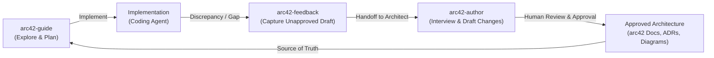

# arc42 Skills for Coding Agents

[](LICENSE)

Open source Agent Skills to navigate, author, and capture feedback on software architecture using the [arc42](https://arc42.org) documentation framework.

When AI coding agents write software without architecture awareness, code drifts from design, documentation rots, and architectural boundaries break. These skills give your agents disciplined, source-grounded architecture workflows that preserve human decision authority.

Compatible with any model and any agent supporting the open Agent Skills standard (Codex, Claude Code, Cursor, Antigravity, Amp, Windsurf, etc.).

---

## Quick Installation (30-second setup)

Install the skills directly using the standard skill manager or copy them into your project:

### Option 1: Using `skills` CLI (Recommended)

```bash
npx skills add qconn-io/arc42-skills
```

Select which skills to install and target agents (Codex, Claude Code, Cursor, Antigravity).

### Option 2: Copy into your project

```bash
# For Codex or generic Agent Skills standard
mkdir -p .agents/skills
cp -r /path/to/arc42-skills/skills/* .agents/skills/

# For Claude Code
mkdir -p ~/.claude/skills
cp -r /path/to/arc42-skills/skills/* ~/.claude/skills/
```

Every skill is self-contained with its own references and templates. No build, no server, and no global runtime required.

---

## Why These Skills Exist

We built these skills to solve the three most common failure modes when using AI coding agents on non-trivial systems:

### #1: The Agent Codes Blind to Architecture
**The Problem:** Coding agents jump straight into editing files without knowing why the system was structured that way, violating component boundaries, coupling rules, and existing decisions.  
**The Fix:** [`arc42-guide`](./skills/arc42-guide/SKILL.md) reads local architecture documentation in place, checks constraints and responsibilities, and drafts a structured change plan citing inspected sources before any code is touched.

### #2: Architecture Documentation Rots
**The Problem:** Keeping 12 arc42 chapters, ADRs, and PlantUML diagrams synchronized with system evolution is tedious and easily abandoned.  
**The Fix:** [`arc42-author`](./skills/arc42-author/SKILL.md) conducts a focused, dependency-ordered interview to clarify intent, maps affected concerns to the right arc42 chapters, and coordinates changes across AsciiDoc prose, ADRs, and diagrams.

### #3: Engineers Hit Discrepancies and Guess
**The Problem:** When an engineer or agent encounters a contradiction between code and architecture during implementation, they either invent intent or create silent workarounds.  
**The Fix:** [`arc42-feedback`](./skills/arc42-feedback/SKILL.md) captures observed behavior, evidence, impact, and a precise architectural question into an unapproved feedback draft for the responsible architect to review.

---

## Skills Reference

| Skill | Description | Primary Role |
|---|---|---|
| **[`arc42-guide`](./skills/arc42-guide/SKILL.md)** | Architecture Q&A and feature change planning | Explore & Plan |
| **[`arc42-author`](./skills/arc42-author/SKILL.md)** | Interactive interview to draft & evolve arc42 docs | Document & Evolve |
| **[`arc42-feedback`](./skills/arc42-feedback/SKILL.md)** | Capture implementation feedback & discrepancies | Flag & Escalate |

---

### 1. `arc42-guide` — Explore & Plan

Answers architecture questions and generates change plans derived strictly from inspected sources. Never writes application code or modifies architectural intent.

- **What it does:**
  - Answers questions about system boundaries, component ownership, runtime interactions, and quality constraints with inspectable citations.
  - Generates structured change plans (using `templates/plan.md`) that map out component placement, affected APIs, and blocking architectural decisions.
- **When to use:**
  - Before starting a feature: *"Where does this new service or logic belong?"*
  - During development: *"What constraints or policies apply to database transactions or retries?"*
  - Refactoring: *"Which components own this data lifecycle?"*
- **How to use:**
  ```text
  $arc42-guide Which documented responsibilities and constraints apply to adding payment retries? Cite current sources; do not edit code or architecture.
  ```
  ```text
  $arc42-guide We need to add an export webhook. Produce a change plan showing component placement and required decisions.
  ```

---

### 2. `arc42-author` — Document & Evolve

Drafts coordinated updates to arc42 documentation (AsciiDoc, ADRs, and PlantUML diagrams) through a disciplined, dependency-ordered interview.

- **What it does:**
  - Interviews the user starting from smallest consequential questions (goals -> boundaries -> interfaces -> failure -> decisions).
  - Identifies the exact affected arc42 chapters (Chapters 1–12), ADRs, and diagrams.
  - Produces surgical, coordinated draft diffs across prose, decisions, and PlantUML diagrams.
  - Requires explicit write-scope authorization before modifying any documentation.
- **When to use:**
  - Starting architecture for a new project from an arc42 template.
  - Documenting a newly approved architectural change, service, or boundary.
  - Updating existing sequence diagrams or building-block views to reflect reality.
  - Processing approved feedback received from engineering.
- **How to use:**
  ```text
  $arc42-author Help me clarify this architecture change. Inspect current sources, then interview me before proposing any write scope.
  ```
  ```text
  $arc42-author Draft the architectural updates for our new audit logging pipeline in Section 5 (Building Blocks) and Section 8 (Cross-Cutting Concepts).
  ```

---

### 3. `arc42-feedback` — Flag & Escalate

Captures engineering difficulties, missing intent, or code discrepancies discovered during implementation as structured drafts for architect review.

- **What it does:**
  - Distinguishes observed implementation behavior from documented intent and engineer opinion.
  - Fills a structured feedback form (`templates/feedback.md`) detailing task context, evidence, engineering impact, and the exact decision requested from the architect.
  - Saves drafts locally as `draft` / `unapproved` (typically under `.arc42-work/feedback/<name>.md`).
  - Offers a clean handoff to `arc42-author` for when the architect reviews the feedback.
- **When to use:**
  - An engineer finds that actual code diverges from arc42 Chapter 5 or runtime diagrams.
  - An implementation choice requires an exception to documented architectural constraints.
  - Required architectural guidance is missing or ambiguous.
- **How to use:**
  ```text
  $arc42-feedback Capture this engineering observation for the architect. Present an unapproved draft before asking where to save it.
  ```
  ```text
  $arc42-feedback Document the discrepancy: our payment provider requires async callbacks, but Chapter 6 only specifies synchronous HTTP.
  ```

---

## The arc42 Architecture Loop

These three skills form a continuous feedback loop between architects and software engineers:



### Core Guardrails & Principles

1. **Source-grounded evidence:** Every architectural claim must cite verified files, revisions, or anchors. If evidence is missing, it remains explicitly labeled `UNKNOWN`.
2. **Intent vs. Observation:** Documented architectural intent is separated from inspected code behavior and recommendations. Code is not self-authorizing intent.
3. **Deliberate, scoped writes:** The agent never silently overwrites files. Write scope must be explicitly authorized. Working plans and feedback drafts remain local (under `.arc42-work/`).
4. **Human authority:** AI skills assist, interview, and draft; human architects make decisions and approve changes. No skill unilaterally grants architectural approval.

---

## Starter Template

Starting arc42 on a new repository? A clean, lightweight arc42 starter template is included under [`templates/arc42/`](./templates/arc42/):
- [`index.adoc`](./templates/arc42/index.adoc): Full 12-section arc42 skeleton with explicit `UNKNOWN` placeholders.
- [`diagrams/context.puml`](./templates/arc42/diagrams/context.puml): Initial PlantUML system context diagram.

Copy it to your project's `docs/architecture/` directory and use `arc42-author` to begin filling it in.

---

## License

[MIT](LICENSE) © 2026 Max Kogan / qconn
